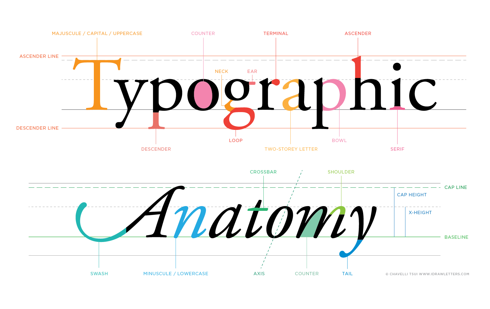

## 1.0 Welcome!

https://youtu.be/n3oa25L6TLg?controls=0

***

## 1.1 Type Design Process Overview

https://youtu.be/jjbGRYZ2SmM?controls=0

***

## 1.2 Anatomy of Type

https://youtu.be/74D-gYNEZ_o?controls=0

> If you want a neat cheat-sheet on hand, check out this Typographic anatomy chart by [Chavelli Tsui](https://chavelli.com/blog/the-anatomy-of-letterforms)!

***

## 1.3 Typeface Classification

https://youtu.be/2WFRVyyZVkg?controls=0

> Footnote:
> 
> 1. I lumped in Old Style and Humanist classifications together, but they can be separated into its own category. (check out I Love Typography blog articles on [Humanist](https://ilovetypography.com/2007/11/06/type-terminology-humanist-2/) and [Old Style](https://ilovetypography.com/2007/11/21/type-terminology-old-style/).
> 
> 2. The Times New Roman typeface is shown as an example of 'Old Style', but technically speaking it is somewhere in the middle of Old Style and Transitional. (check out [Wikipedia](https://en.wikipedia.org/wiki/Times_New_Roman) for more info). That being said, it has a noticeable angled stress that I consider to be the easiest way for beginners to spot an old style typeface, so i chose to put it in the old style category.

***

## 1.4 Languages and Scripts

https://youtu.be/Zk4okpZNALc?controls=0

***

## 1.5 Kerning and Spacing

https://youtu.be/4BVPOaybluc?controls=0

***

## 1.6 Modularity of Type

https://youtu.be/5J5A3wanb80?controls=0

***

## 1.7 Optical Compensation

https://youtu.be/cc41wlRZNC4?controls=0

***

## 1.8 Type as Technology

https://youtu.be/5gmfvckcxuw?controls=0

***

## 1.9 Where to Find Fonts

https://youtu.be/iFzioBtE6mY?controls=0
